# Methodology

# 1. System Architecture Overview

## 1.1 High-Level Architecture


## 1.2 Detailed System Architecture
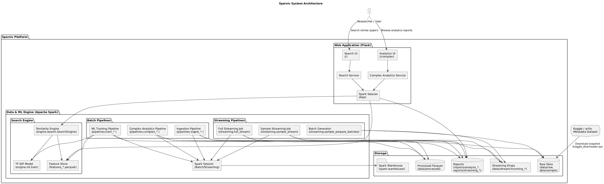

---

# 2. Data Ingestion & Preprocessing (Structured APIs)

## 2.1 Ingestion Workflow
```python
df_raw = spark.read.json(input_path)
```

## 2.2 Transformations
```python
df = df.withColumn("title_clean", clean_text(F.col("title")))
```

## 2.3 Storage Format
```python
df.write.mode("overwrite").parquet(out_path)
```

---

# 3. Spark SQL Analytics

Below are the full-analysis outputs.

### Abstract Length vs Versions (Deciles)
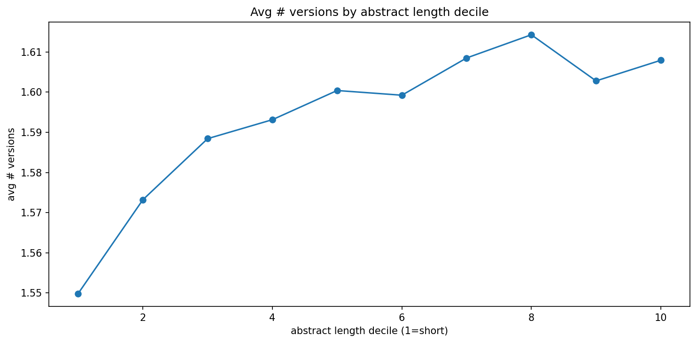

### Abstract Length vs Versions (Correlation)
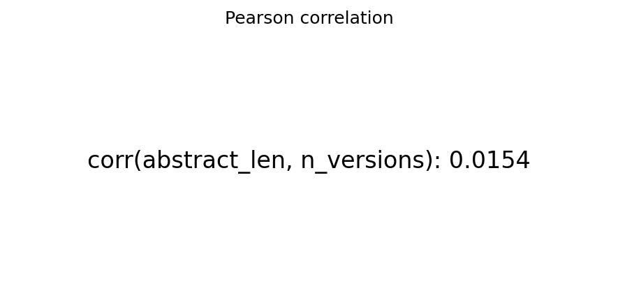

### Author Category Migration
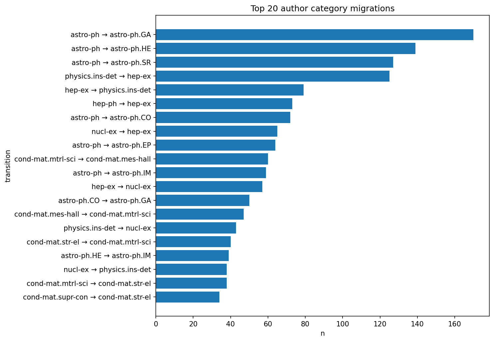

### Author Collaboration Over Time
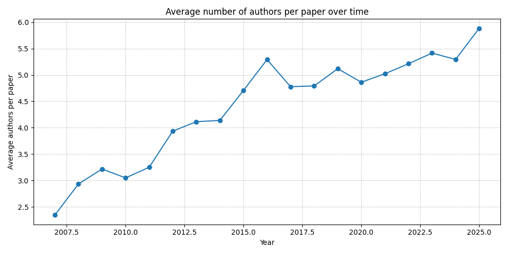

### Author Lifecycle
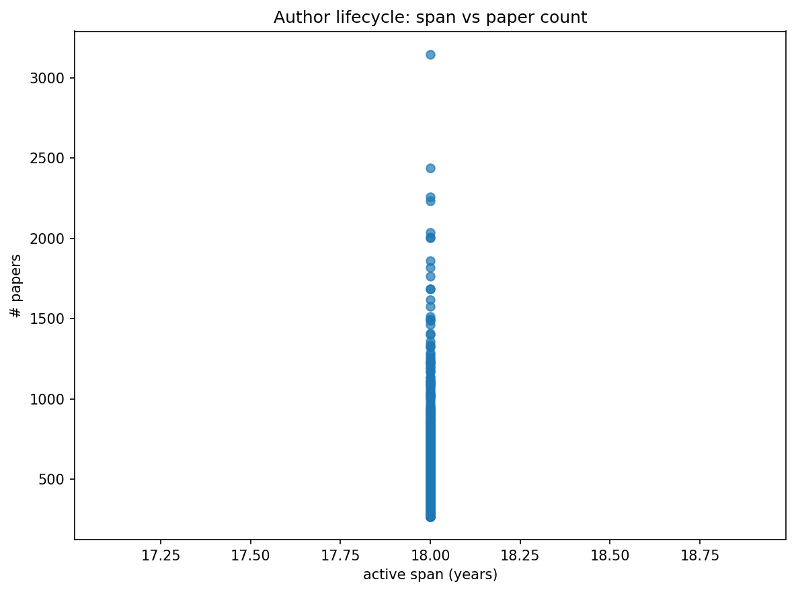

### Avg Token Count by Year


### Category Cooccurrence
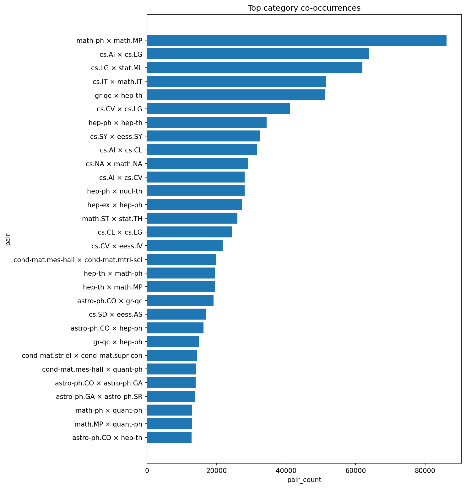

### Category Versions Avg
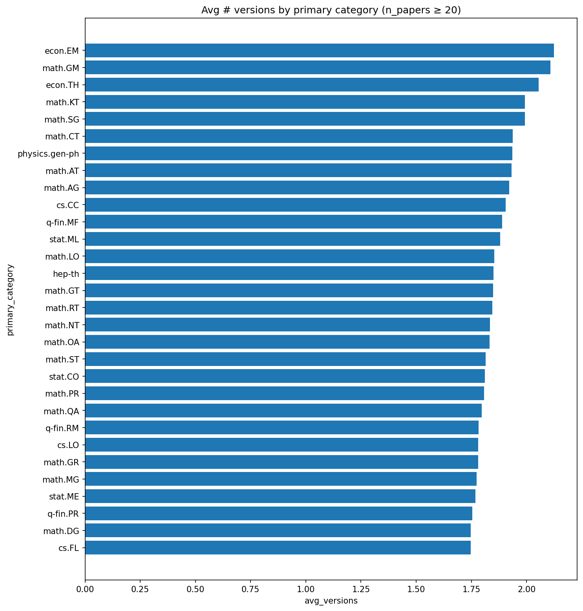

### Declining Topics
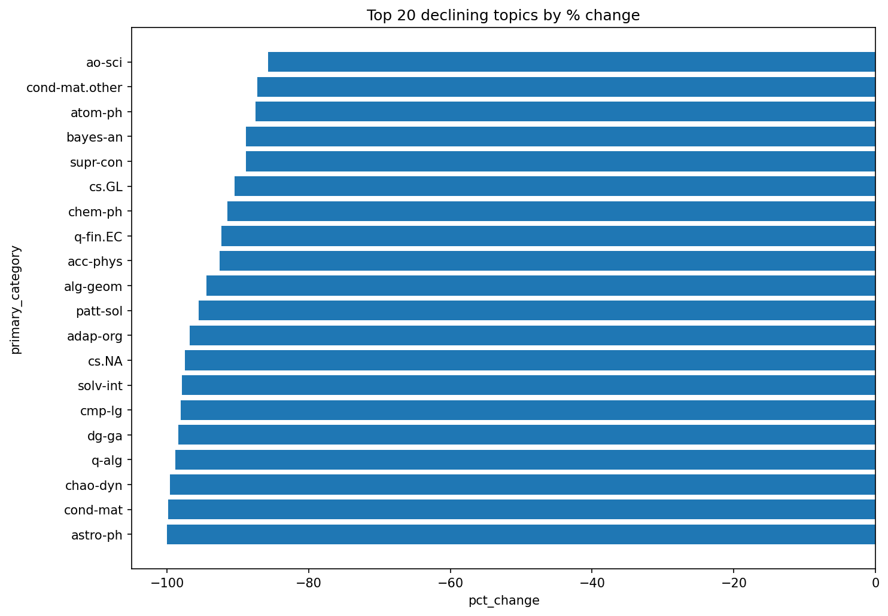

### DOI Versions Correlation
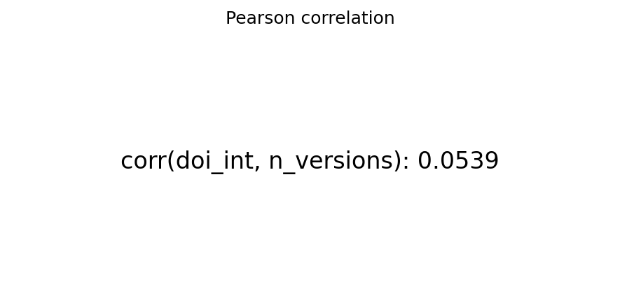

### DOI vs Versions Group
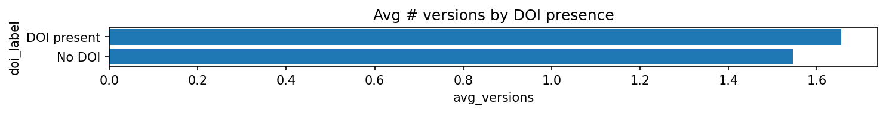

### Lexical Richness by Year
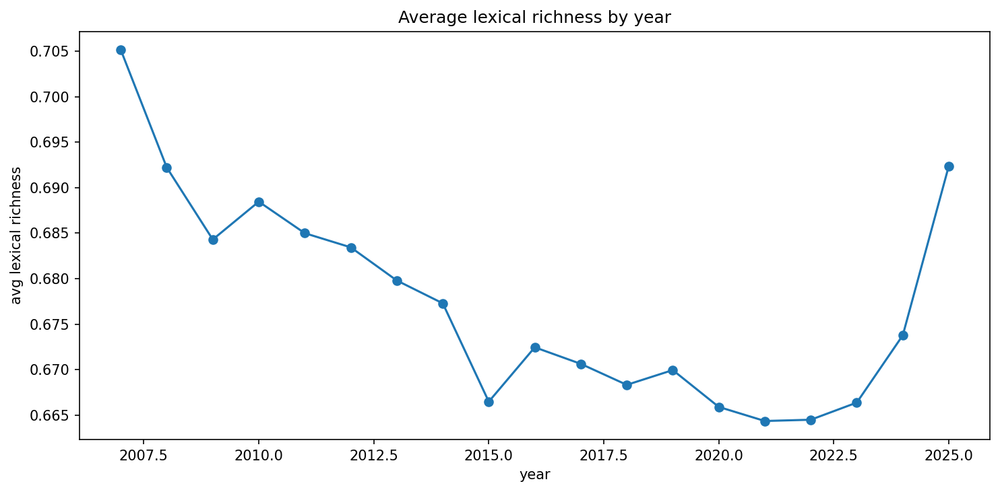

### Rising Topics
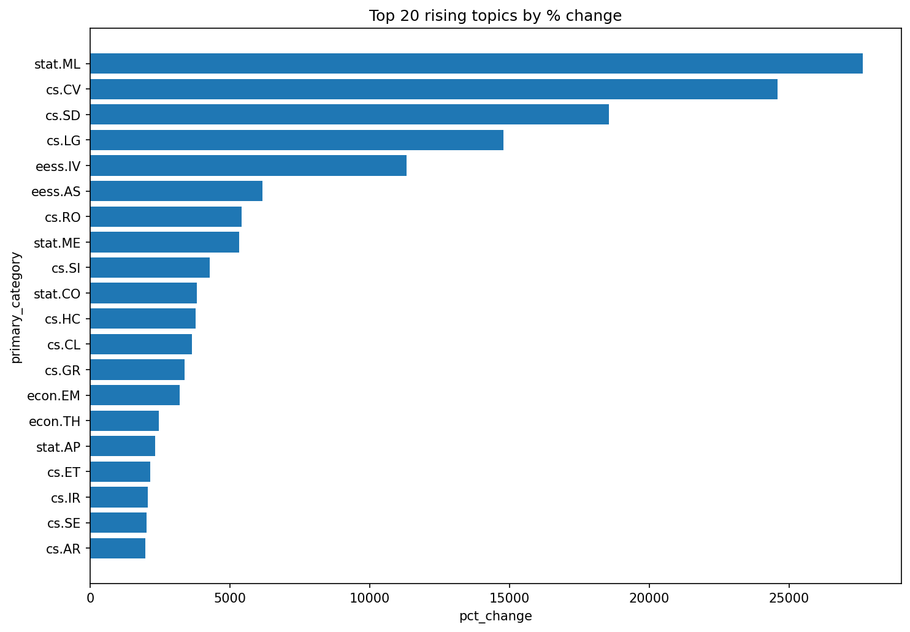

---

# 4. Standard Queries (Full Dataset)

### Abstract Length Histogram


### Category Pareto


### Category-Year Heatmap


### DOI Rate by Year


### Papers per Year


### Top Authors


### Top Categories


### Version Count Histogram


---

# 5. ML Pipeline

```python
pipeline = Pipeline(stages=[tokenizer, stopwords, vectorizer, idf, normalizer])
```

---

# 6. Similarity Search

### Sample Mode
```python
score = dot(q.toArray(), v.toArray())
```

### Full Mode (CSR)
```python
scores = csr_matrix @ query_dense
```

---

# 7. Streaming

```python
stream_df = spark.readStream.schema(schema).json(stream_path)
```

Example:

