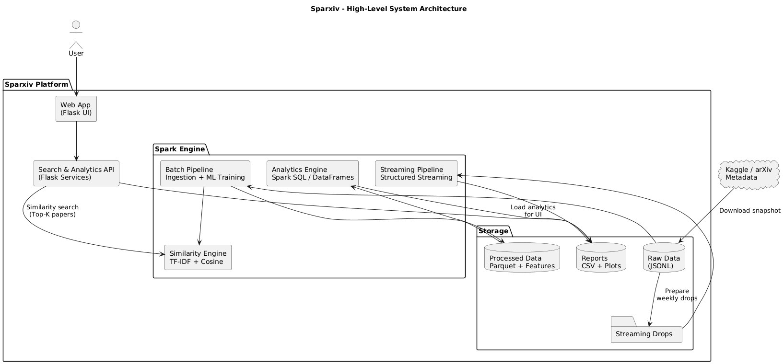

# Methodology

This document explains the full internal workflow of **Sparxiv**, including ingestion, feature engineering, similarity search, complex analytics, and streaming architecture.

---

# 1. System Architecture Overview

Sparxiv follows a multi-stage Spark + Flask architecture.

### High-Level Architecture Diagram


### Detailed System Architecture


---

# 2. Ingestion Pipeline

## 2.1 Reading Raw JSON

Input source:
- `arxiv-metadata-oai-snapshot.json` (Kaggle)
- JSON or JSONL format

Spark loader:
```
spark.read.json(..., multiLine=True|False)
```

## 2.2 `transform_all()` Overview  
Located in: `engine/data/transformations.py`

### Key Transformations
| Task | Function |
|------|----------|
| Clean title & abstract | `clean_text()` |
| Normalize lowercase | `lower()` |
| Extract primary category | `extract_primary_category()` |
| Split categories → array | `split_categories()` |
| Extract year from update_date | `parse_year_from_datestr()` |
| Normalize authors → list | `normalize_authors()` |
| Compute text lengths | `abstract_len`, `title_len` |
| Count authors & categories | `n_authors`, `n_categories` |
| Detect DOI presence | `has_doi` |
| Quality filter | abstract length ≥ 40 |

### Output Schema (simplified)
```
arxiv_id
title_clean
abstract_clean
primary_category
category_list
authors_list
year
abstract_len
title_len
n_authors
n_categories
has_doi
versions
...
```

## 2.3 Output Layout

Outputs stored in:
```
data/processed/arxiv_full/
data/processed/arxiv_sample/
```

- Partitioning: **year** (default)
- Compression: **Zstandard (ZSTD)**
- File size tuning: max ~50k rows per Parquet part file

---

# 3. Feature Engineering (TF-IDF Pipeline)

Located in: `engine/ml/featurization.py`

## 3.1 Pipeline Stages

1. `RegexTokenizer`
2. `StopWordsRemover`  
   - English stopwords  
   - domain stopwords  
   - optional “extra stopwords” based on top-DF tokens
3. Optional bigram detector
4. `CountVectorizer`
5. `IDF`
6. `Normalizer(L2)`

### Output Column
```
features_norm : SparseVector
```

## 3.2 Training Configurations

### Sample Pipeline (`pipelines/train_sample.py`)
```
vocab_size=80000
min_df=3
use_bigrams=False
extra_stopwords_topdf=200
```

### Full Pipeline (`pipelines/train_full.py`)
```
vocab_size=120000
min_df=10
use_bigrams=False
extra_stopwords_topdf=0   # disabled for performance
```

---

# 4. Query Vectorization & Search

## 4.1 Query Vectorization  
`engine/search/vectorize.py`

Process:
1. Combine title + abstract
2. Tokenize → remove stopwords
3. Transform through TF-IDF pipeline
4. Produce an L2-normalized SparseVector

## 4.2 Exact Cosine Similarity  
`engine/search/similarity.py`

```
score = dot(query_vector, candidate_vector)
```

Implements:
- Efficient UDF dot-product over SparseVectors  
- `crossJoin` for brute-force comparison  
- Window + `row_number()` for Top-K ranking

## 4.3 High-Level API  
`engine/search/search_engine.py`

```
engine = SearchEngine(mode="sample" | "full")
results = engine.search(title="...", abstract="...", k=10)
```

Pipeline:
1. Vectorize query  
2. Compute Top-K candidates  
3. Join with metadata (title, year, categories)  
4. Return ordered result list  

---

# 5. Complex Analytics Layer (10 Modules)

Located in: `engine/complex/complex_queries.py`

### Modules
1. Category co-occurrence  
2. Author collaboration over time  
3. Rising topics  
4. Declining topics  
5. Lexical richness  
6. DOI vs versions correlation  
7. Author productivity lifecycle  
8. Author category migration  
9. Abstract length vs popularity  
10. Category stability via versions  

### Output Format
- CSV summaries  
- PNG charts  

Output directories:
```
reports/analysis_full/
reports/analysis_sample/
```

---

# 6. Streaming Workflow (Optional)

Files:  
- `streaming/sample_stream.py`  
- `streaming/full_stream.py`

Workflow:
1. Monitor incoming JSONL drops  
2. Apply `transform_all()`  
3. Compute:
   - by-year counts  
   - category distribution  
   - DOI rate  
4. Save CSV + PNG into:
```
reports/streaming_sample/YYYYMMDD/
reports/streaming_full/YYYYMMDD/
```

---

# 7. End-to-End Pipeline (`run.sh`)

```
1. Download dataset (if missing)
2. Ingest full dataset
3. Train TF-IDF model
4. Run complex analytics
5. (Optional) Start streaming jobs
```

Outputs generated:
```
data/processed/arxiv_full/
data/models/tfidf_full/
data/processed/features_full/
reports/analysis_full/
```

---

# 8. Key Design Choices

### ✔ Spark as unified compute layer  
Handles batch, ML, and streaming.

### ✔ TF-IDF instead of embeddings  
- Fast  
- Transparent  
- Runs well on CPU  
- Highly reproducible

### ✔ Exact cosine similarity  
- Deterministic  
- Ideal for academic evaluation  
- Avoids ANN approximation errors

### ✔ Modular pipeline  
Each stage (ingestion, ML, search, analytics, streaming) is independently executable and testable.

---

# 9. Limitations

1. Brute-force similarity search does not scale to extremely large vector sets.  
2. TF-IDF lacks semantic depth (no scientific embedding models used).  
3. Kaggle schema changes may break ingestion code.  
4. Version histories are not fully leveraged for analysis.

---

# 10. Summary

Sparxiv implements a complete Spark-powered architecture that:

- Ingests and normalizes raw arXiv metadata  
- Produces TF-IDF representations  
- Supports exact cosine similarity search  
- Performs 10 deep analytical modules  
- Supports both batch and streaming execution  

It provides a fully reproducible end-to-end data/ML pipeline.
